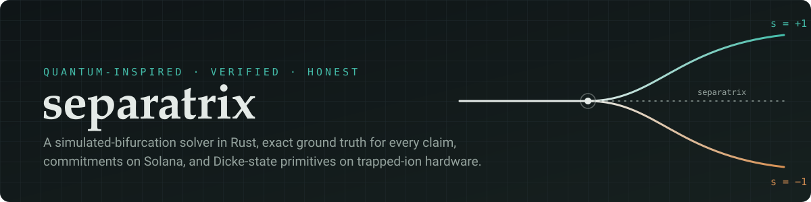
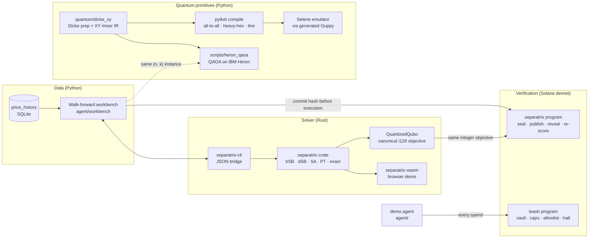

<div align="center">



<br>

[](https://github.com/Iamsohungrynow/separatrix/actions/workflows/ci.yml)
[](https://crates.io/crates/separatrix)
[](https://docs.rs/separatrix)
[](https://explorer.solana.com/address/CsnV36BSJsfCRSrJQSCddi5ZM7XAA8KVpL8ziCh7xSzp?cluster=devnet)
[](LICENSE)

**[Run it in your browser](https://separatrix.vercel.app/demo/)** · [Docs](docs/README.md) · [Workbench study](docs/workbench.md) · [On-chain contract](docs/onchain.md) · [Quantum primitives](docs/primitives.md) · [Changelog](CHANGELOG.md)

</div>

---

Separatrix is a research monorepo about one question: **how well do quantum-inspired
and quantum methods actually solve a cardinality-constrained selection problem, and can
you prove it?** It answers that with a solver you can benchmark, a chain that can check
the answer, and a quantum primitive characterised the way a referee would want it.

It is deliberately allergic to hype. Every number in this repository is labelled
**measured**, **estimated**, or **NOT RUN**; the headline metric is the optimality gap
against an *exact* optimum, never PnL; and nothing here claims quantum advantage.

## Three pillars, one history

| Pillar | What it is | Where it lives | Status |
| --- | --- | --- | --- |
| **Solver** | Simulated bifurcation (bSB/dSB, Toshiba lineage) in pure Rust, shipped *with* its baselines: simulated annealing, parallel tempering, and Gray-code exact enumeration. Deterministic per seed, compiles to `wasm32`, quantizes the objective to `i128` so anyone can re-score a solution exactly. | [`separatrix/`](separatrix/) · [crates.io](https://crates.io/crates/separatrix) · [browser demo](https://separatrix.vercel.app/demo/) | shipped |
| **Verification** | Two Anchor programs on Solana devnet. `separatrix` commits an allocation *before* execution and later re-derives its integer objective on-chain. `leash` is a spending firewall: a program-owned vault with a per-transaction cap, daily budget, allowlist, and owner kill switch that an autonomous agent cannot negotiate with. | [`programs/`](programs/) · [`docs/onchain.md`](docs/onchain.md) · [`docs/design.md`](docs/design.md) | deployed on devnet, unaudited |
| **Quantum** | The *same* constraint ("exactly k of n") attacked with constraint-preserving ansätze: Bärtschi–Eidenbenz Dicke-state preparation + XY-ring mixers, characterised across (n, k) on all-to-all, heavy-hex and linear connectivity, with physical ion leakage separated from Hamming-weight loss on Quantinuum's Selene emulator. Plus a QAOA pipeline for IBM Heron that refuses to overclaim. | [`quantum/`](quantum/) · [`scripts/heron_qaoa.py`](scripts/heron_qaoa.py) · [`docs/primitives.md`](docs/primitives.md) · [`docs/quantum.md`](docs/quantum.md) | emulated; no hardware job submitted |

The Python side ([`agent/`](agent/)) ties them together: a walk-forward workbench that
solves every rebalance of a real crypto universe with every solver *and* by exhaustive
enumeration, and a demo agent whose spends are metered through the leash.

## The honesty contract

- **"Quantum-inspired" is a description, not a claim.** Simulated bifurcation is a
  classical Hamiltonian ODE. Nothing in the solver touches a qubit.
- **Ground truth or nothing.** The workbench only publishes a gap where the exact
  optimum was proven; the enumerator refuses instances it cannot finish rather than
  guessing. Where exact wins, the docs say exact wins.
- **The chain checks, it does not trust.** A revealed allocation is re-scored on-chain
  from the sealed coefficients; the objective the chain computed equals the solver's
  integer exactly, or the reveal fails.
- **Hardware numbers come from hardware.** The quantum artifacts are emulator runs and
  say so in their first line. Every hardware column reads NOT RUN until a job runs.
- **Pre-committed comparisons.** Baselines, cost sensitivities, and the parallel-tempering
  comparison were fixed before the results were in, and are published whatever they show.

If you find a number that does not survive scrutiny, open a
[claim challenge](https://github.com/Iamsohungrynow/separatrix/issues/new?template=claim_challenge.yml).
Correcting it is the point.

## Try it in sixty seconds

**In a tab** — the real crate, compiled to WebAssembly, on real Binance covariance:
[separatrix.vercel.app/demo](https://separatrix.vercel.app/demo/). Drag the universe up
and watch exact enumeration fall off a cliff while the heuristics barely notice. That
cliff is the entire argument for heuristics; below it, they are a losing trade.

**In Rust:**

```bash
cargo add separatrix
```

```rust
use separatrix::{IsingModel, QuboModel, Solver, SbConfig};

let mut qubo = QuboModel::<f64>::new(3);
qubo.set_term(0, 0, -1.0);
qubo.set_term(1, 1, -1.0);
qubo.set_term(0, 1, 2.0);
qubo.set_term(2, 2, -1.0);

let (ising, offset) = IsingModel::from_qubo(&qubo);
let result = Solver::Sb(SbConfig::default()).solve(&ising).unwrap();
println!("bits = {:?}, objective = {}", result.bits(), result.energy + offset);
```

**The full study, from a clean checkout** (Python 3.12, Rust stable; the data layer
backfills from Binance public klines first — see [`docs/workbench.md`](docs/workbench.md)):

```bash
pip install -r requirements.txt
cd separatrix && cargo build --release && cd ..
python -m agent.workbench --start 2021-06-01 --end 2026-07-31 --k 8 \
  --solvers bsb,dsb,sa,pt,exact --bps 0,10,30 --seed 42 \
  --max-exact-subsets 100000000 --publish-dashboard
```

**The quantum sweep** (own venv, Python ≥ 3.12, no account needed — Selene runs offline):

```bash
python -m venv .venv-quantinuum
.venv-quantinuum/Scripts/python -m pip install -r requirements-quantinuum.txt   # bin/ on POSIX
python -m quantum.characterise --n 4 6 8 10 12 --k-mode all --shots 1000 --selene-max-n 12
```

## Architecture



Four independent implementations of the on-chain commitment preimage must agree — the
program, the Rust exporter, the Python client, and a test-vector file — and CI diffs the
committed IDLs against their generators so interface drift fails the build instead of
surfacing on devnet.

## What the measurements say

All figures below are copied from committed artifacts; each links to its source.

**Solver quality** — walk-forward study, 39 assets, K = 8, 234 weekly rebalances
(2022-02 → 2026-07), exact ground truth on **100 %** of them, up to C(39, 8) = 61.5 M
subsets per rebalance ([`docs/workbench.md`](docs/workbench.md), [`dashboard/workbench.html`](dashboard/workbench.html)):

| Solver | Median `gap_norm` | At the exact optimum | Mean runtime |
| --- | ---: | ---: | ---: |
| exact | 0 | 100 % | 274.3 ms |
| bSB | 0.031 | 15.0 % | 2.2 ms |
| SA | 0.079 | 0 % | 1.4 ms |
| PT | 0.110 | 0 % | 4.9 ms |
| dSB | 0.325 | 0 % | 1.8 ms |

Read it straight: at this size exact enumeration is affordable and **wins outright**.
bSB buys a 128× speed-up by landing ~3 % of the way along the achievable objective
range; dSB is poor on these instances. The case for a heuristic starts where C(N, K)
stops being enumerable — which is exactly what the browser demo lets you feel.

**On-chain verification** — measured compute units on devnet
([`docs/onchain.md`](docs/onchain.md)): `reveal_allocation` cost tracks *k*, not *n*
(≈ 8.5 k CU at k = 4 → ≈ 61 k CU at k = 24), which is why `MAX_CARDINALITY = 40` exists.
The chain-computed objective equalled the solver's integer exactly
([reveal tx](https://explorer.solana.com/tx/DoNokzvPXDyMkq8V42wERNr5PCZRizAbKwJrDCJ2GZjoADSi8hWR2bGfnC3gsTvh2LdNoqG4SZMDPnUVPPav7MB?cluster=devnet)).

**Connectivity ledger** — Dicke + XY-ring ansatz, 35 (n, k) points, n = 4…16, identical
pass sequence and native gate set on three coupling graphs
([`reports/examples/dicke-characterisation/`](reports/examples/dicke-characterisation/report.md), emulated):

| Arm | Two-qubit gates vs all-to-all (median) | Range |
| --- | ---: | ---: |
| heavy-hex (IBM Heron map) | **1.96×** | 1.00× – 2.28× |
| linear | **2.20×** | 1.60× – 2.65× |

Under a spec-parameterised depolarising model the Hamming-weight sector loss is
≈ 6.8 × 10⁻⁴ per two-qubit gate across circuits whose gate counts differ by 34×, so the
in-constraint probability of a circuit nobody has run is predictable from its compiled
gate count. Physical ion leakage and sector loss are reported *separately*, shot by shot.
The routing tax does **not** visibly widen with n at n ≤ 16; that is reported as a flat
column, not fitted. A one-level divide-and-conquer construction (Aktar et al.) is also
implemented and verified to the same floor: on all-to-all it roughly halves two-qubit
depth against the 2019 cascade but stays ≈ 1.8× above the published CNOT counts, and the
doc says exactly which gadget decomposition that excess comes from.

**QAOA, simulated** — n = 10, k = 3, XY mixer on a Dicke state, noiseless
([`reports/examples/heron-simulation/`](reports/examples/heron-simulation/report.md)):

| Sampler | Mean `gap_norm` per shot | P(optimum) per shot | Feasible shots |
| --- | ---: | ---: | ---: |
| uniform random feasible portfolio | 0.463 | 0.008 | 100 % |
| QAOA p = 2, XY/Dicke | **0.203** | **0.066** | 100 % |
| QAOA p = 2, X mixer + penalty | 0.453 | 0.004 | 61 % |

With only 120 feasible portfolios, "QAOA found the optimum" means nothing — random
guessing finds it too. The per-shot distribution bias is the *only* defensible claim,
and the artifact says so in those words. **Hardware: NOT RUN.**

## Live on Solana devnet

| | Address / signature |
| --- | --- |
| `separatrix` program | [`CsnV36BSJsfCRSrJQSCddi5ZM7XAA8KVpL8ziCh7xSzp`](https://explorer.solana.com/address/CsnV36BSJsfCRSrJQSCddi5ZM7XAA8KVpL8ziCh7xSzp?cluster=devnet) |
| verified reveal (chain objective == solver objective) | [`DoNokz…av7MB`](https://explorer.solana.com/tx/DoNokzvPXDyMkq8V42wERNr5PCZRizAbKwJrDCJ2GZjoADSi8hWR2bGfnC3gsTvh2LdNoqG4SZMDPnUVPPav7MB?cluster=devnet) |
| `leash` program | [`EZQjF3NwVTMUrRdDiCwzuabFEoe2viVfFhEaWPkj6gkV`](https://explorer.solana.com/address/EZQjF3NwVTMUrRdDiCwzuabFEoe2viVfFhEaWPkj6gkV?cluster=devnet) |
| leash created (0.05 SOL per-tx, 0.2 SOL daily) | [tx](https://explorer.solana.com/tx/33s3t4QjE1FbTK4xByqNpARth4RVFzpNv9s1QxmjuMrZjV6dJ9y9amvL89eckL2PtQ5vhgHVoj5A87zd2nPyiaqZ?cluster=devnet) |
| agent spend approved and transferred | [tx](https://explorer.solana.com/tx/5Pt2CWCmRagDJFdtXu7C8LkU1a21AjThQpgCJkGvtjZNkhYkefrsUdMnLDWSQZGVSH7Xr5hXcEBNH5CcdWN4A4Mc?cluster=devnet) |
| kill switch pulled / released | [halt](https://explorer.solana.com/tx/37MKR64c4KMhKPpWHdmfe5VKhToJQ8suRkstTbnmXGMoftpZePpmzZYc7qoVvvmDestnjap5r6f3aidzhx6fMKPa?cluster=devnet) · [resume](https://explorer.solana.com/tx/57kKyMNMg8jc3rLDjH5zC4duTXtCEHckjX3HvNmWPcQnrAeNyNFKNvxHpuJSUsMkyGkckygvMEhdHH39deYjNSgh?cluster=devnet) |

The workbench study itself is a *report*, not a chain record: the studies that exist
on-chain are smaller instances created to exercise and measure the program.
Both programs are devnet software and have not been audited.

## Quickstarts by pillar

<details>
<summary><b>Solver crate and browser demo</b></summary>

```bash
cd separatrix
cargo test --workspace                                   # unit, property, doc, CLI protocol
cargo clippy --workspace --all-targets -- -D warnings
cargo bench                                              # criterion throughput on dense spin glasses
cargo check --no-default-features --target wasm32-unknown-unknown
```

Rebuild the browser bundle with `scripts/build-wasm-demo.sh` (needs `wasm-bindgen`;
the generated `site/demo/pkg/` is committed so the site deploys toolchain-free). The
crate is its **own cargo workspace**, deliberately excluded from the repo root.

</details>

<details>
<summary><b>Workbench and demo agent (Python)</b></summary>

```bash
pip install -r requirements.txt
cp .env.example .env
python -m unittest discover -s tests -v          # 406 tests
python -m agent.main --init-db --once            # one demo-agent cycle, local simulator
uvicorn agent.api.server:app --reload            # observability API; then open dashboard/index.html
```

The walk-forward contract (formulation, protocol, metrics, JSON bridge) is
[`docs/workbench.md`](docs/workbench.md). Read it before changing anything it governs.

</details>

<details>
<summary><b>On-chain programs (Solana devnet)</b></summary>

Prereqs: Node 18+, devnet keypairs under `keys/` (`scripts/setup-devnet.sh` generates and funds them).

```bash
npm install
npm run separatrix:smoke        # create → write → seal → publish → reveal, verified end to end
npm run devnet:smoke            # leash: approved spend, cap rejection, allowlist rejection, halt, resume
npm run separatrix:measure      # compute-unit measurements behind docs/onchain.md
npm run verify:owner-ix         # byte-compares the wallet console's encoder against Anchor
```

Owner console with no CLI: open [`dashboard/owner.html`](dashboard/owner.html) and
connect a wallet. Building the programs needs the Solana 1.18 SBF toolchain; the
committed IDLs mean you do not need it to *use* the deployed programs. Toolchain
invariants (lockfile v3, hand-mirrored IDL generators) are in [`AGENT.md`](AGENT.md).

</details>

<details>
<summary><b>Quantum primitives (Quantinuum stack) and QAOA (IBM)</b></summary>

```bash
# Dicke + XY characterisation on Selene (offline, no account)
.venv-quantinuum/Scripts/python -m quantum.characterise --n 4 6 8 10 12 14 16 --k-mode all \
  --p 1 --shots 1000 --selene-max-n 12 --max-statevector-n 16
.venv-quantinuum/Scripts/python -m unittest discover -s tests -p test_quantum_dicke.py

# QAOA pipeline: simulation only by default, --dry-run is ON
pip install -r requirements-quantum.txt
python scripts/heron_qaoa.py --fake-backend FakeKingston     # routed gate counts, executes nothing
python scripts/heron_qaoa.py --backend ibm_kingston --no-dry-run   # the one command that uses a QPU
```

Prior art, conventions, and the two corrections that must not be re-introduced (the
routing tax is 1.96×, not 3.6×; "leakage" means ions leaving the computational manifold)
are in [`docs/primitives.md`](docs/primitives.md) and [`docs/quantum.md`](docs/quantum.md).

</details>

## Repository map

```
separatrix/          Rust solver crate (own workspace): sb · sa · pt · exact · quantized · portfolio
  cli/               JSON stdin/stdout bridge the Python workbench shells out to
  wasm/              wasm-bindgen bindings for the browser demo
programs/            Anchor programs: separatrix (commit + re-score) and leash (spending firewall)
idl/                 Committed IDLs, generated by scripts/gen-*.js and diffed in CI
scripts/             devnet bridges (TypeScript), IDL generators, heron_qaoa.py, wasm build
agent/               Python: demo agent, FastAPI, price history, workbench (walk-forward harness)
quantum/             Dicke + XY IR, verification, pytket compile arms, Selene backend, the sweep
tests/               406 Python tests (68 of them quantum), Anchor TypeScript suites
dashboard/           Live monitor, wallet owner console, workbench report viewer
site/                separatrix.vercel.app: landing page and the WASM demo
reports/examples/    Committed artifacts: workbench study, Dicke characterisation, QAOA simulation
docs/                Contracts and references (start at docs/README.md)
```

## Validation surface

Green in CI on every push: Python lint + 406 tests, the pytket layer of the quantum
tests, TypeScript type-check, IDL-vs-generator diffs, the SBF lockfile guard, and the
Rust crate's format, tests, clippy, wasm32 check, and docs build.

Run locally, not in CI: the Selene/Guppy layer (`requirements-quantinuum.txt`), the
devnet smoke scripts (they move real devnet SOL), and the Anchor suites against a local
validator (`npm run test:anchor`).

## Status and roadmap

Shipped: solver crate, portfolio workbench with proven optima, browser demo, both devnet
programs, wallet owner console, Dicke/XY characterisation with a committed 35-point
report, QAOA pipeline verified in simulation.

Not built, and therefore not claimed: a hardware run on any QPU, a calibrated
Helios noise model (server-side only), a transpiler-seed sweep on the heavy-hex arm,
SPL-token vaults for the leash, a packaged SDK, automatic on-chain publication of the
workbench's live rebalances. See [`docs/ROADMAP.md`](docs/ROADMAP.md).

## Contributing and citing

Contributions are welcome — see [`CONTRIBUTING.md`](CONTRIBUTING.md) for the three
toolchains, the invariants, and the rules for claims. Coding agents should read
[`AGENT.md`](AGENT.md). Security reports: [`SECURITY.md`](SECURITY.md).

If Separatrix is useful in your research, cite it via the repository's
[`CITATION.cff`](CITATION.cff) (GitHub renders a "Cite this repository" button).

## Author and license

Separatrix is built and maintained by **Martina**
([@Iamsohungrynow](https://github.com/Iamsohungrynow)). The repository grew through two
earlier incarnations — a research-signal paper trader (QubitAlpha) and the Leash spending
firewall — and keeps that history rather than rewriting it.

Released under the [MIT License](LICENSE).
